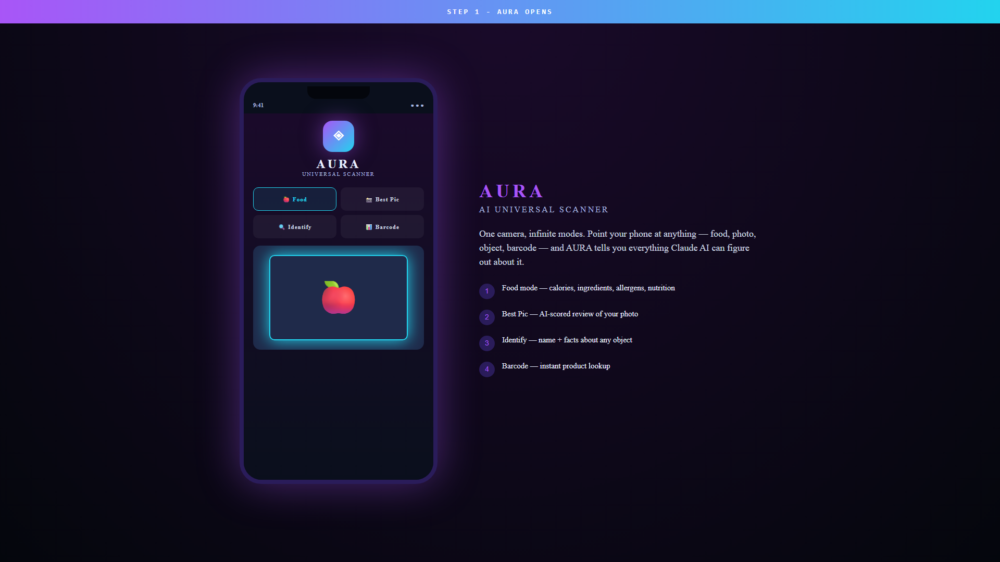

# 📸 AURA

### AI Universal Scanner — point your phone at anything, get instant analysis

-orange?style=flat-square)

---

> ## 🔒 Source code is private — request access via my GitHub profile.

---

## What is AURA

AURA is an Android app powered by **Claude AI** that scans ANY object with the phone camera and instantly tells you everything about it.

- 🍎 Food? AURA returns calories, ingredients, allergens, and a nutrition card
- 📸 Photo? Best Pic mode scores your photo as an AI critic would
- 🔍 Object? Identify mode names it + facts
- 📊 Barcode? Instant product lookup

One app. Many modes. Same AI brain.

## Demo

(Video URL inserted after drag-drop upload.)

## Architecture

| Layer | Tech | Job |
|-------|------|------|
| Mobile | Flutter (Android-first, iOS-ready) | UI + camera + result cards |
| Backend | Firebase Cloud Functions | proxy + key custody |
| AI | Claude API (Anthropic) | image understanding + response writing |
| Auth | Firebase Auth | Google sign-in |
| Storage | Firestore | user history |

## Reliability — fallback chain

AURA uses a **Claude → Sonnet → Opus → Haiku** fallback chain. If Anthropic's busiest model is overloaded, AURA silently demotes one tier and keeps responding instead of failing.

## Status

🚀 Live on V2427 (Firebase project `aura-app-3681`).
🎯 Play Store launch pipeline ready — signing key + icon + privacy policy live.

## Contact

For source-code access or an internal-test APK, reach out via my GitHub profile.

## Licence

(c) 2026 Danish · All rights reserved.
